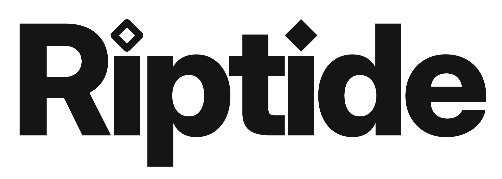

<p align="center">
  <picture>
    <source media="(prefers-color-scheme: dark)" srcset="brand/riptide-wordmark-white.svg">
    <source media="(prefers-color-scheme: light)" srcset="brand/riptide-wordmark.svg">
    
  </picture>
</p>

# Riptide

A browser motion-graphics and image editor with a small Flask backend for video export.

## Video mode
- Layers: rectangle, ellipse, polygon, star, arc, text, image; move, resize, snap to centre, hide/lock, reorder, duplicate, copy/paste
- Groups: select layers and press Cmd+G (or right-click > Group) to group them; move, resize, turn, scale, fade or keyframe the group to do it to all of them; expand/collapse it in the layer list; Shift+Cmd+G ungroups, leaving each layer where it shows. Groups do not nest, and 3D layers do not follow their group yet
- Keyframe any property with 23 easing curves; edit text in place on the canvas
- Fonts: the system's own, a library of 55 web fonts (sans, serif, display, script and monospace, each previewed in itself in the Font menu and fetched only when used), or your own .ttf, .otf, .woff or .woff2 file, saved inside the project. Text also takes italic, alignment (left, centre, right), case (as typed, UPPERCASE, lowercase, Title Case) and leading (line height, keyframeable); exports wait for every font to load
- Timeline: zoom (Ctrl/Cmd + wheel, slider, Fit), expandable per-property keyframe rows, layer in/out trim bars, slide layers in time, split at playhead (Cmd+K), markers (M), snapping to playhead/markers/keys/edits (hold Shift to bypass)
- Blend modes, colour adjustments (brightness, contrast, saturation, hue, grayscale, sepia, invert) and blur/shadow, all keyframeable
- 44 animation presets: click to apply at the playhead or drag onto a layer in the viewer or timeline
- Video clips as layers: import or drop MP4/WebM/MOV, trim with the layer bar, set Source in, animate/adjust/blend like any layer; frame-accurate in exports. A split clip carries on from the frame it was split at
- Clip sound: a video clip keeps its own sound, in the preview and in exports, drawn as a waveform along its bar, with Volume % (keyframe it to ride the level), Mute, and fades in and out. Set an audio track to Duck and it dips under the clips' own sound while it is loud, like someone talking, and comes back up after
- Speed and time: Speed % on any video clip (keyframe it for a smooth ramp, or Ramp up and Ramp down from the right-click Speed menu, with 25% to 400% presets), Reverse to play it backwards, and Hold this frame to freeze the playhead's frame for two seconds and push the rest of the clip later. Sound follows the speed, higher when faster
- Transitions: Crossfade, Dip to black or white, Wipe, Slide, Push, Zoom, Blur, Glitch and Spin, on any layer's way in or out from the right-click menu, with a direction for wipes, slides and pushes. Transition to next clip overlaps a clip with the one after it and blends them. Drag the shaded end of a bar to change how long it takes, or double-click it to remove it
- Masks and green screen: cut any layer to a rectangle, an ellipse or a shape you draw point by point on the canvas, with Feather for a soft edge and Invert to keep the outside; mask position, size and feather can be keyframed. Track matte shows a layer only through the one above it (by its alpha or its brightness, or the inverse), so video can play inside text. Key out turns a green or blue screen clear on any picture or video, with Tolerance, Softness and Spill, and the key colour picked straight off the canvas
- Colour grading: Warmth and Tint, Exposure, levels (in and out black and white, Gamma), curves for RGB and each channel drawn in the panel, a Vignette, and 3D LUTs loaded from .cube files and kept in the project, with LUT mix. An Adjustment layer grades, blurs and masks everything under it at once
- Graph editor (G, or the curve button on the timeline): the selected layer's animated numbers as curves over time. Drag a key to move it in time and value (Shift keeps to one axis), drag its handles to shape the curve into the next key as a custom bezier, and double-click a curve to add a key on it. Pick a property on the left to see its curve alone, with its range
- Import by dropping files anywhere (onto the viewer to place them), pasting with Cmd+V, or dragging an image straight from another web page
- Resizable layers panel: drag its right edge for width and the bar under the layer list for height (double-click to reset)
- Drag with the middle mouse button to drag a copy: a layer on the canvas, a layer's bar in the timeline, or a keyframe. The original stays where it was
- Select several layers: Shift- or ⌘-click on the canvas or in the Layers panel (Shift-click there selects a range), drag a box on empty canvas, or ⌘A. Move, nudge, duplicate or delete them together
- Align and centre: an Align bar in the Design panel (one layer aligns to the canvas, several to each other), Centre on canvas (⌥C), distribute three or more evenly; also in the right-click menu
- Audio tracks: import as many files as you like, each on its own track (clips on different tracks play together). Drag clips in time or onto another track, trim their edges, split at the playhead (⌘K), delete with ⌫, and drag the dots at a clip's top corners to fade it in or out (drag back, or double-click a dot, to remove the fade). Everything is mixed into MP4, WebM and MOV exports
- 3D: turn any layer into a 3D layer (Rotate X and Y, Depth) from its Design panel; add lit 3D shapes (cube, sphere, cylinder, cone, torus, 3D text) with matte, glossy or metal finishes from the cube button in the toolbar; import .glb, .gltf or .obj models by dropping them in; and add a Camera layer to orbit, tilt, dolly, zoom and roll around it all. Right-click a 3D shape or model and choose Export as 3D model to save it as a .glb file (a canvas pixel is a centimetre). Everything animates, and the 3D animation presets (Flip, Swing in, Fly in, Turntable, Orbit around, Push in…) work on any 3D layer or the camera
- 3D worlds: a whole place to film, from the World section of the cube button. A world shows only inside its own box: resize or move it like any layer. A procedural sky with a sun and drifting clouds (golden hour, clear day, dusk, haze, overcast, night or a studio), the ground (an ocean whose breaking wave curls and throws its lip as you key Curl, a wheat field swaying in the wind, desert dunes, a mountain valley with a winding road, pine forest and snowy peaks, or a studio floor), fog and dust in the light, height fog that fills a valley and thins towards the peaks, lit where it faces the sun, and props built from parts (boxes, cylinders, lattice towers and beams, glowing screens) in worn metal, leatherette, brushed aluminium, chrome, coated lens glass and more. The sun casts shadows, and the world is filmed through a lens: focal length, depth of field, bloom, contact shadows, film grain and colour fringing. 3D shapes and models above a world layer stand inside it. Start from a scene (Golden wave, Camera rig in a field, Studio, Desert at dusk, Night sea, Mountain road), each keyed with a slow camera move, or from an empty one; every setting animates
- Scene editor: Edit scene on a world layer opens a workspace with an outliner of its props, a viewport to orbit round them or look through the film camera, move/turn/scale gizmos and an inspector. Its Ghost view (V) flies you through the scene: WASD to move, Q/E down and up, move the mouse to look (the cursor is hidden and held in the middle, so you can turn all the way round; if the browser refuses, drag to look), Shift for speed, scroll to change speed, Esc to leave. Speed lock in the toolbar makes scrolling change the speed in steady, fixed steps, for trackpads and Magic Mice; it is remembered in this browser. It only moves the viewport, never the film camera or the render. The 3D shape and model layers above the world are listed under 3D layers in the outliner, and can be picked and moved there like props (their shape and look stay in their Design panel). With Snap on (the default), whatever you move drops onto the ground or onto the top of what it is over. A wheat field's Sway m/s sets how hard the wheat sways (as in Camera rig in a field), and Loop sway fits it to the video's length so the last frame meets the first. Import your own sky photos (.hdr) to light and back the world, materials made from a scanned surface's images (colour, normal, roughness and ambient occlusion, sorted by their file names) for any prop or the ground, and .glb, .gltf or .obj models as props at their real size, from the Import menu or by dropping them on the viewport. They are kept in the project
- Path tracing: set a world's Render to Path traced and its frames follow light bounce by bounce: light from the sky and from everything lit, soft shadows, real reflections, glass that bends what is behind it, and true depth of field from the lens. Exports (and agents' frames) give each frame all its Samples before keeping it; the scene editor's Path traced view clears up while you watch. The ocean's waves, the breaking wave, wheat and dust are left out of path traced frames (still water stands in for a sea)
- Sketch and push/pull: model the way CAD apps on a tablet do. Sketch a Rectangle, Circle or Polygon on the ground or on any face of a prop (snapped to a 5 cm grid, Alt for none, its size shown as you draw), then pull its orange arrow to extrude it into a solid. Pull a sketch into the prop it was drawn on and it cuts a hole or a pocket. Push/pull drags any face of any prop in or out, a box's or a cylinder's included. Revolve turns a sketch round its left edge into a turned part. A sketch stays editable: its width, length, radius, depth and turn are numbers in the inspector until Make editable makes it a mesh.
- Modelling: any prop can be made an editable mesh in the scene editor. Edit mesh (Tab) picks points (1) or faces (3) and moves, turns and scales them with the gizmo; Extrude (E), Inset (I), Bevel (Ctrl B), Loop cut (Ctrl R), Delete (X) and Merge (M) shape it; Subdivide rounds it off (Catmull-Clark), with Smooth shading and Apply subdivision. Join with, Cut with and Keep overlap with combine it with another prop (booleans). Sculpt shapes it with a brush: Draw, Smooth, Grab, Inflate and Flatten, Ctrl for the opposite, [ and ] to size it, Add detail for finer work. Meshes are kept in the project
- Shots: put cameras in a 3D world (+ Add, Camera) and cut between them with Cut to it here, at any moment on the timeline, like an edit; the World inspector lists the cuts. A camera has its own lens, focus (on a prop or at a distance) and depth of field, can look at a prop, and has a Hand-held shake. Key a camera's (or any prop's) place three times or more and it flies a smooth path through the keys; Faces: the way it travels turns it along its path. World speed % slows or speeds everything in the world (key it for speed ramps), Motion blur° gives exported frames a shutter, and Letterbox frames the picture at 2.39, 2 or 1.85 to 1
- Cars and people: + Add, Car, Person or Crowd in the scene editor. Key a car's place and it drives its path, wheels turning with the distance and steering into the bends, head and tail lights lit (Beams light the road at night). A person walks, runs, stands, waves, dances or sits, their steps keeping pace with how far their keys take them, with their own height, skin, top, trousers and hair. A crowd fills an area with people coming and going, as mannequins or as copies of an imported rigged model. Imported rigged models play their own animation clips (Clip, Speed, Start at, round and round or once)
- Night, weather and effects: Rain falls round the camera, Wet ground mirrors every light in its puddles and sheen, Light shafts stream from the sun past what stands in front of it, Lens flare and Light streaks (anamorphic) catch bright lights, and a spot light's Beam shows its light in the air. + Add, Effect places smoke, fire, steam, sparks, dust thrown up from the ground, or an explosion that goes off at a moment you choose (with its flash); + Add, Neon sign glows with your words, steady or flickering, lighting what is near it; + Add, Building stands with storeys of windows, some lit. Start from Neon night: a wet city street in the rain, with traffic, people, neon and street lights, letterboxed and filmed low
- Beats: Find the beats (the bars button in the timeline) listens to the music for its kicks and puts a beat marker on each, with the tempo; then put a hit on every beat at once: Zoom punch, Shake, Glitch, Blur hit, Strobe, Slam, Spin hit, or a white Flash over the whole frame. RGB split is an effect of its own under Effects, and Hard B&W and Night drive are looks under Adjust
- Physics: set any flat layer to Falls and it drops, bounces, tumbles and slides off everything Fixed (a floor, a ramp, a platform you keyframe to push things), with bounce, friction, weight, a push and spin, and the scene's gravity, walls and air drag. Animate a layer, then let it fall at a moment of your choosing and it carries on at the speed it had: throw it. The scene is simulated the same way every time, so scrubbing and exports are exact. Presets: Let it fall, Throw it, Bouncy ball and Heavy and dead run the physics once and write the fall as keyframes, until the layer comes to rest, so it shows on the timeline like any animation; Make it solid sets a layer Fixed. Right-click a falling layer to bake its physics to keyframes too
- Music: make any number follow the song (from a layer's Design panel, or the Music presets): scale punching on the kick, a shake on the snare, brightness on the hats, a glow with the vocals, a bounce with the bass, or just how loud it is, by any amount and eased back over a time you choose. Each link listens to the whole mix, or to one audio track: import stems (drums, bass, vocals) as tracks of their own and each layer follows its own. Without stems, the kick, snare, hats and vocals are picked out of the mix. Exports wait for the music to be heard, so every frame is right
- Figures: a person to pose and animate (the person button in the toolbar). Drag its hands, feet, elbows, knees, head and chest on the canvas and the limbs follow; every joint keyframes, Side view turns it from facing you to side on, and Joint caps fades the lighter caps on its elbows, knees, shoulders and hips, down to none. Presets: Walk, Walk across, Run, Jump, Wave hello, Dance, Sit down, Cheer, T-pose. Set it to Falls and it is a ragdoll, every limb jointed
- Gradients: linear or radial, through up to five colours (Fill, up to three Via stops, Fill 2), and morphing from one kind to the other with To radial %; colours can be linked to the project's colour constants (Composition, Colours), like CSS's --accent
- Export: MP4 (H.264/AAC), WebM (VP9/Opus), MOV (ProRes 422 HQ), GIF, PNG sequence (zip), or a still frame; 24/25/30/60 fps; sizes up to 8K; whole timeline or between markers. Presets set it all in one pick: YouTube 1080p and 4K, Shorts, Reels and TikTok (9:16), Instagram square and portrait, transparent ProRes 4444 and WebM, a small web version and GIF, plus your own saved settings. Frame exports to 16:9, 9:16, 1:1 or 4:5 whatever the canvas, filled (cropped to the middle) or fitted with bars; Transparent leaves out the background for WebM, MOV, PNG and still PNG or WebP, to lay over other footage

## Image mode
Switch with Video / Image in the header. The timeline is hidden; importing an image into an empty canvas opens it at full resolution.
Adjust colour, apply looks (Vivid, Warm, Cool, Faded, Vintage, Noir, Mono, Punch, Negative), flip, blend layers, add shapes and text, then export PNG, JPEG or WebP.

## Install

Linux and macOS:

    curl -fsSL https://raw.githubusercontent.com/Natuworkguy/Riptide/main/install.sh | bash

Windows (PowerShell):

    irm https://raw.githubusercontent.com/Natuworkguy/Riptide/main/install.ps1 | iex

The installer puts Riptide in its own Python environment, adds a `riptide` command, an applications menu (or Start
menu) entry with Riptide's icon (and a Riptide app in Applications on a Mac), and registers `riptide://open` links.

Riptide is a desktop app: each of these opens it in a window of its own, with no address bar or tabs, and starts its
server if it is not running. Nothing to set up: the window is Chrome, Edge, Brave or Chromium in app mode with a profile
of its own, so it sits in the dock or taskbar as Riptide and remembers its size; on a computer with none of those it is
a native window when pywebview is installed, else a browser tab. `riptide --tab` (or `RIPTIDE_OPEN=tab`) opens a tab
instead, and from a tab, the browser's Install app button makes it an app too. `riptide --stop` stops the server. Run the installer again to update. `--dev` installs the dev branch,
where changes land first (on Windows: `& ([scriptblock]::Create((irm https://raw.githubusercontent.com/Natuworkguy/Riptide/main/install.ps1))) -Dev`),
and `--uninstall` (`-Uninstall`) takes Riptide back out. ffmpeg is still yours to install, for video export.

## Run

    brew install ffmpeg          # only needed for MP4/WebM/GIF export
    python3 -m venv .venv && .venv/bin/pip install -r requirements.txt
    .venv/bin/python server.py   # http://127.0.0.1:5173

Projects save as `.rip` files (images and audio embedded; older `.wob` files still open) with the browser's own Save/Open dialogs.

Reload a window and it comes back as it was, unsaved changes included: each window keeps its work in the browser,
under the window's own id, for two weeks. A new window starts fresh. New projects start at 1080×1080 unless you pick a
size and choose **Use this size for new projects** from the canvas size menu.

3D worlds are drawn by the server, not your browser tab: `server.py` keeps a windowless browser of its own (Chrome or Edge
when you have one, else Playwright's Chromium, which the installer fetches) and the editor shows the pictures it sends.
A heavy scene can no longer take the editor down, and if that browser falls over the server starts another. Right-click
the canvas and untick **Draw 3D on the server** to draw in the tab again. Set `RIPTIDE_BROWSER` to use a particular
Chrome or Chromium. An install from before this sets itself up the first time the editor asks: the server installs
Playwright into its own environment and drives Chrome, Edge, Brave or Chromium if one is installed, or downloads
Chromium if none is. So a browser that has WebGL switched off (Brave can, for privacy) still gets 3D.

## Flash extension

This repository is also a Flash extension: it lets Flash send the pictures and 3D models it makes to Riptide, as
layers in the project open there, to animate or put in a video.

    flash install github@Natuworkguy/Riptide

It adds a `send_to_riptide` tool (just ask: *put that chair in Riptide*), a `/riptide [path]` command (the newest
picture or model Flash showed, when no path is given), and a **Send to Riptide** button (the cube icon) in the bar of
any 3D model you open in Flash's web UI. With more than one Riptide window open, the button asks which project to send to, and Flash picks a window (or asks you) before its tools act. Pictures (.png, .jpg, .webp, .gif, .svg) become image layers and models (.glb, .gltf,
.obj) 3D layers. When Riptide is not open, it starts it (with the installed `riptide` command) and waits for the
editor. Its address, and whether to open it, are in the extension's settings. Agents can do the same through MCP with
`add_image` and `add_model`.

Riptide can have any number of windows open, each a project of its own. Flash and agents work in the window used
last, or in one they name by its project or open themselves: `riptide_windows` in Flash and `list_windows`,
`use_window` and `open_window` over MCP. Flash's `send_to_riptide` and `riptide_world` take a `window` (a project's
name, or `new`).

## Tutorial
Help in the header (or **F1**) opens a tutorial in 14 sections, from the first layer to 3D, the camera, exporting and working with an agent, with buttons that try each thing on the spot. It is offered once on a first visit.

## Shortcuts
Press **?** in the editor for the full list (80 commands), or **Cmd+P** for the command palette, which searches every
command, layer, animation preset and canvas size, and jumps to a time if you type one (`2.5s`).
Highlights: R O P S A W T add shapes and text · Tab / Shift+Tab cycle layers · H hide · L lock · 0-9 opacity ·
Alt+A/D/W/S/H/V/C align · Cmd+[ ] arrange · K key all · Shift+K remove keys · J / ; previous / next keyframe ·
E cycle easing · [ ] trim · Alt+[ ] slide layer · Cmd+K split · M marker · Shift+M / Alt+M jump markers ·
I / U layer start / end · Shift+Space play from start · F focus mode · Cmd+Shift+E save frame as PNG.

## Live MCP server (let agents see and edit the animation)

`mcp_server.py` is a stdio MCP server. It talks to `server.py`, which relays each request to the Riptide tab open in your
browser, so agents work on the live project: changes appear instantly, go into undo history, and nothing is saved
until you save. The **Live** badge over the viewer turns green when the tab is linked (amber while an agent is working).

1. `.venv/bin/pip install -r requirements.txt` (adds `mcp`)
2. Run `.venv/bin/python server.py` and open http://127.0.0.1:5173
3. Point your MCP client at the URL **http://127.0.0.1:5173/mcp** (streamable HTTP, served by server.py).
   Or, for clients that only do stdio:

```json
{ "mcpServers": { "riptide": {
    "command": "/path/to/riptide/.venv/bin/python",
    "args": ["/path/to/riptide/mcp_server.py"] } } }
```

Tools: `get_project`, `get_layer`, `list_capabilities`, `see_frame` (image of one moment), `see_frames` (contact sheet over time),
`add_layer`, `update_layer`, `set_keyframes`, `delete_keyframes`, `apply_preset`, `delete_layer`, `reorder_layer`,
`set_composition`, `new_project`, `set_playhead`, `select_layer`, `add_marker`, `undo`, `redo`, `get_project_json`.
Set `RIPTIDE_URL` if the editor is not at http://127.0.0.1:5173. With several tabs open, the newest one is used.

Snapping: dragging an object snaps its edges and centre to the canvas and to other layers, with red guide lines;
hold Alt or Cmd to move freely.

Canvas size: the Composition **Preset** menu has social (Instagram, Story/Reel, TikTok, Shorts, X, LinkedIn, Facebook),
video (720p to 4K, vertical, cinema) and web sizes, plus Custom. **Scale content** fits the existing design into the new
frame; **Keep size** only re-centres it. **Rotate** swaps width and height.

## Contributing

Work happens on the `dev` branch; `main` holds releases. See [CONTRIBUTING.md](CONTRIBUTING.md).

3D is drawn with [three.js](https://threejs.org) (MIT), with three-gpu-pathtracer, three-mesh-bvh and three-bvh-csg (MIT), bundled in `static/vendor/three`, with the Droid Sans Bold typeface (Apache 2.0) for 3D text.
